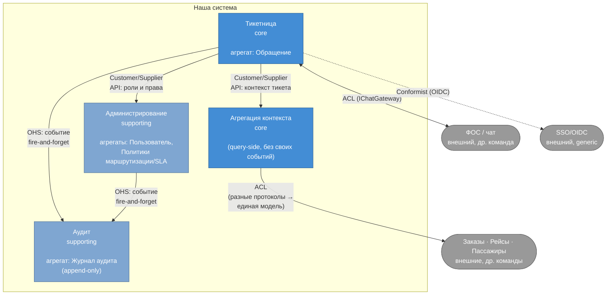

# Карта Bounded Context и сервисы-кандидаты

Построено по швам, найденным в [Event Storming](event-storming.md): где менялся актор, где менялся язык/причина изменения, где агрегат физически другой. Для сверки — независимая декомпозиция по business capability уже сделана в [service-decomposition.md](service-decomposition.md).

## Как выделены границы

| Шов, замеченный в Event Storming | Что он означает |
|---|---|
| У блока «Администрирование» свой актор (только Админ), свои агрегаты («Пользователь», «Политики маршрутизации/SLA»), меняется по своей причине | Отдельный контекст, не связан с логикой обращений |
| «Аудит» не рождает своих доменных событий — только подписывается на чужие через политику | Отдельный контекст-потребитель (downstream), не диктует модель другим |
| Актор «Клиент» физически находится не в нашей системе (README: «Пользователи системы» — только Агент/Супервизор/Админ) | Граница системы проходит здесь — ФОС/чат снаружи, доступ только через контракт |
| Агрегат «Обращение» держит весь жизненный цикл: создание, статус, эскалацию, приоритет, закрытие | Ядро — контекст «Тикетница» |

**Важное наблюдение:** «Агрегация контекста» (сбор данных о заказе/рейсе/пассажире) не породила ни одного события в нашем Event Storming — там нет «фактов, которые произошли», только чтение и кэширование чужих данных. Это нормально: Event Storming лучше всего выявляет границы там, где домен богат событиями (write-side); для query-side контекстов границу пришлось взять из [service-decomposition.md](service-decomposition.md), а не вывести из событий.

## Карта контекстов

## Сервисы-кандидаты и владение данными

| Сервис-кандидат | Контекст | Владеет (агрегаты / данные) | Класс |
|---|---|---|---|
| **Тикетница** | Ведение обращения от создания до закрытия | Агрегат «Обращение»: id, статус, приоритет, назначенная линия/агент, история эскалаций и переназначений, комментарии, ссылка на чат-тред (не сам тред — он у ФОС), таймстемпы SLA | Core |
| **Агрегация контекста** | Сбор и кэш контекста из внешних источников | Кэш производных данных (заказ, рейс, пассажир) — не источник истины, только для отображения | Core |
| **Администрирование** | Пользователи, роли, права; правила маршрутизации и SLA-политики | Агрегат «Пользователь» (id, роль, права доступа к ПДн); агрегат «Политики маршрутизации/SLA» (конфигурация, не per-тикет данные) | Supporting |
| **Аудит** | Неизменяемый журнал действий (в т.ч. фактов просмотра ПДн) | Агрегат «Журнал аудита»: append-only записи «кто/что/когда» | Supporting |

**Сверка:** список и границы совпали с независимой декомпозицией по business capability из [service-decomposition.md](service-decomposition.md) (Тикетница / Агрегация / Аудит / Администрирование) — два разных метода подтвердили одни и те же 4 сервиса. Единственное расхождение: Event Storming не смог сам «нащупать» границу Агрегации (нет событий), пришлось опираться на capability-анализ — хороший повод явно написать в выводах домашки, что методы дополняют друг друга, а не взаимозаменяемы.
