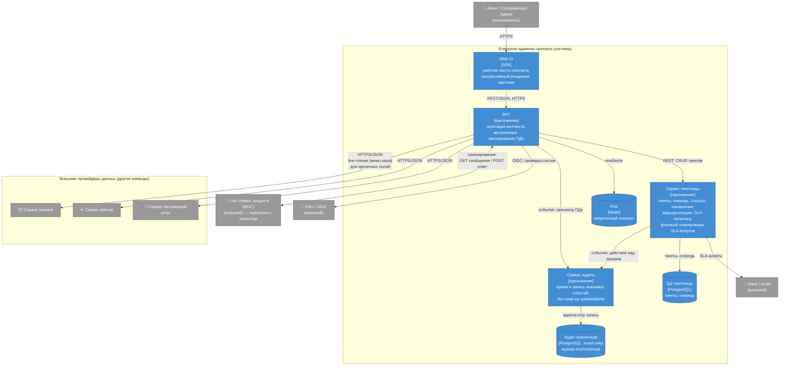

# C4 — Container (C2)

Первый зум внутрь системы: из каких частей она собрана. Контейнер в C4 — это то, что **разворачивается отдельно**: приложение, база данных, кэш. Не модуль и не класс, а самостоятельная единица развёртывания. По этому критерию у системы четыре приложения-контейнера и три хранилища.

Контекстная диаграмма — см. [C4 Context](c4-context.md), драйверы — [Utility Tree](utility-tree.md), компромиссы — [Trade-offs](tradeoffs.md).

## Диаграмма

## Контейнеры и откуда какие требования

**Web UI (SPA)** — рабочее место агента, супервайзора и админа. Разворачивается отдельно (статические ассеты), в браузере не ходит во внешние сервисы напрямую — только в BFF. Прогрессивный рендеринг карточки — из компромисса [TO-1](tradeoffs.md) (S3, S12, S13).

**BFF** — единая точка входа для UI. Собирает контекст тикета из внешних продуктовых сервисов и приводит его к единой модели (S15), проверяет права и **маскирует ПДн до отдачи в UI** (S6), проксирует операции над тикетами в ядро. Некритичный контекст берёт из кэша, критичные к времени поля (статус/время рейса) — всегда live (S3, TO-1). Также **проксирует переписку с клиентом** к чат-сервису продукта (ФОС): показывает агенту входящие сообщения и отправляет его ответы. В отличие от read-only источников данных, это двусторонняя интеграция (чтение + отправка); самим тредом переписки система не владеет — он живёт в ФОС.

**Сервис тикетницы** — доменное ядро: тикеты, очередь, статусы, назначения, маршрутизация, SLA-политика (S2, S4, S5). Внутри него живёт **фоновый планировщик SLA-алертов**: периодически сканирует дедлайны и шлёт оповещения в Slack/email (S1). Отдельным контейнером планировщик не выделен — см. ниже.

**Сервис аудита** — принимает события от BFF (просмотры ПДн) и от ядра (действия над заказами) и пишет их в неизменяемое хранилище. Вынесен отдельно по трём причинам: у него **два писателя** (BFF и ядро) — логику незачем дублировать; **изоляция ради неизменяемости** — основной код не имеет прав на update/delete журнала; **другой профиль нагрузки** — поток fire-and-forget записей не должен влиять на latency агента (S10).

**Хранилища.** БД тикетницы (тикеты, очередь), аудит-хранилище (append-only журнал) и кэш Redis (некритичный контекст) — три отдельных контейнера данных.

## Что не нарисовано и почему

- **Планировщик SLA-алертов** — это компонент внутри сервиса тикетницы, а не отдельный контейнер. Он не требует независимого масштабирования (одна проверка раз в минуту), не имеет отдельного жизненного цикла и полностью зависит от данных тикетницы. Отдельный деплой ничего не даёт, а сложность добавляет. Всплывёт на уровне C3 (Component).
- **Адаптеры внешних источников** (anti-corruption layer из S14) — компоненты внутри BFF, разворачиваются вместе с ним. На уровне контейнеров показывать их было бы нарушением определения «контейнер = отдельная единица развёртывания».
- **Проверка ролей и маскирование** — тоже компоненты BFF, не самостоятельные контейнеры.

Внутренности BFF и тикетницы — предмет следующего уровня C4 (**Component**). В этом задании он не требуется.
