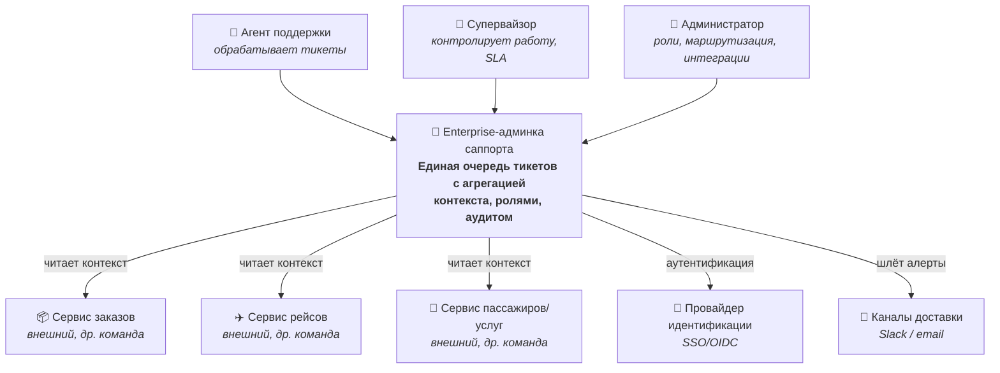

# C4 — Context (C1)

Система как единое целое, её пользователи и внешнее окружение. Контекст системы — см. [README](../README.md), драйверы — [Utility Tree](utility-tree.md), компромиссы — [Trade-offs](tradeoffs.md), контейнеры — [C4 Container](c4-container.md).

**Границы системы.** Внутри — рабочее место саппорта и всё, что управляет тикетами. Снаружи — продуктовые сервисы других команд (заказы, рейсы, пассажиры): система только **читает** из них контекст, но не владеет этими данными.
