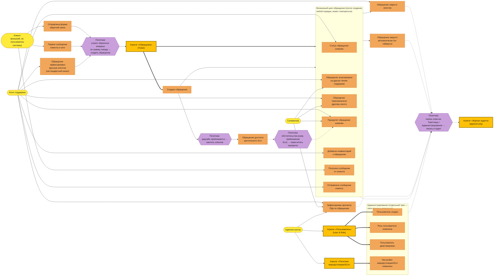

# Event Storming — карта событий

## Легенда цветов (классическая схема Бриджа/Брандолини)

| Цвет | Тип | Вопрос |
|---|---|---|
| 🟧 Оранжевый | Событие (Domain Event) | Что уже произошло |
| 🟦 Синий | Команда | Что кто-то попросил сделать |
| 🟨 Жёлтый, крупный/жирная рамка | Агрегат | Кто обрабатывает команду и хранит состояние |
| 🟡 Жёлтый, светлее/тонкая рамка | Актор | Кто инициировал команду — стрелка ведёт к событию/агрегату |
| 🟪 Фиолетовый | Политика | «Когда X, то автоматически Y» |
| 🟩 Зелёный | Read model | Что видит актор перед решением |
| 🟥 Розовый | Внешняя система | Кто снаружи участвует |

