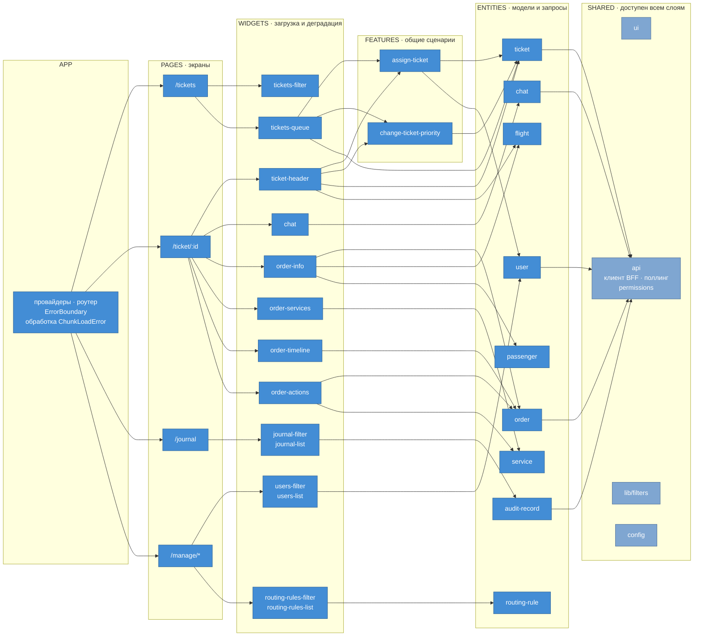
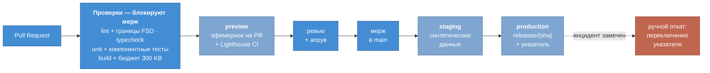

# Фронтенд-архитектура

Декомпозиция фронтенда, модель рендеринга и сборки, масштабирование и контур доставки.

Контекст — [README](../README.md), драйверы — [Utility Tree](utility-tree.md), компромиссы — [Trade-offs](tradeoffs.md), контейнеры — [C4 Container](c4-container.md).

**Вводные:** React + TypeScript, одна фронтенд-команда 3–6 человек, одно SPA на все роли (агент, супервайзор, администратор).

## Ключевые решения

| ADR | Решение | Причина |
|---|---|---|
| [0003](adr/0003-features-inside-widgets.md) | Фичи по умолчанию живут внутри виджетов | у большинства сценариев ровно один потребитель, слой из двадцати срезов-однодневок дороже пользы |
| [0004](adr/0004-permissions-in-shared.md) | Права — инфраструктурный сервис в `shared` | ответ `/permissions` — плоский список строк, доменной семантики не несёт |
| [0005](adr/0005-csr-over-ssr.md) | CSR; SSR и SSG отвергнуты | система внутренняя и за SSO — индексация не нужна, а рендеринг на сервере добавил бы точку отказа в проде и персональные данные в HTML, не ускорив открытие карточки |
| [0006](adr/0006-polling-over-push.md) | Поллинг вместо push-канала | опрос возвращает состояние целиком, поэтому обрыв связи не превращается в пропущенный дедлайн ([S1](utility-tree.md)) |
| [0007](adr/0007-single-repo-no-microfrontends.md) | Единый репозиторий, без микрофронтендов | техническую изоляцию уже даёт code splitting, организационная при одной команде не нужна |
| [0008](adr/0008-atomic-deploy-and-rollback.md) | Атомарный деплой, откат переключением указателя | предыдущая версия возвращается за секунды, а не за прогон пайплайна — при бюджете простоя 44 минуты в месяц это решающе ([S5](utility-tree.md)) |

---

## 1. Декомпозиция: Feature-Sliced Design

Главная проблема фронтенда здесь — не объём кода, а связность вокруг графа данных «заказ → сегменты рейса → пассажиры → багаж → услуги → история» ([S12](utility-tree.md)). FSD даёт правила зависимостей, проверяемые линтером, и деление по домену, а не по технической роли.

Слои идут слева направо, зависимости — в ту же сторону. У `ui`, `lib/filters` и `config` входящие стрелки не нарисованы намеренно: этими модулями пользуются все слои, и рисовать связи означало бы соединить каждый узел с каждым.

### Правила границ

1. **Импорт только в нижележащие слои** (на схеме — правее). Обратно и вбок запрещён.
2. **Срезы одного слоя не видят друг друга** — композиция происходит на слое выше.
3. **Public API** — срез экспортирует только через `index.ts`.
4. **Критерий выноса в `features`** — два и более потребителя ([ADR 0003](adr/0003-features-inside-widgets.md)).

Правила 1–3 контролируются линтером (`@feature-sliced/eslint-config`), иначе деградируют до пожеланий. Слой `processes` из ранних версий FSD не используется.

### Разметка

| Маршрут | Роль | Композиция |
|---|---|---|
| `/tickets` | агент, супервайзор | `tickets-filter` + `tickets-queue` |
| `/ticket/:id` | агент, супервайзор | `ticket-header` + `chat` + `order-*` |
| `/journal` | супервайзор, админ | `journal-filter` + `journal-list` |
| `/manage/users` · `/manage/routing` | админ | фильтр + список |

**Виджеты** грузят данные сами и деградируют независимо, поэтому отказ одного источника не роняет карточку ([S6](utility-tree.md)). Архитектурно нагруженные: `tickets-queue` — виртуализация под 10 000+ ([S4](utility-tree.md)) и подсветка срочных по вылету ([S2](utility-tree.md)); `ticket-header` — статус, приоритет, SLA-таймер, время до вылета ([S1](utility-tree.md), [S2](utility-tree.md)); `chat` — проксирование переписки через чат-сервис продукта (ФОС), тредом система не владеет.

**Фичи.** В слое `features` только `assign-ticket` и `change-ticket-priority` — обе нужны и в очереди, и в карточке. Остальные живут внутри своих виджетов ([ADR 0003](adr/0003-features-inside-widgets.md)): смена статуса, закрытие и эскалация — в `ticket-header`; отмена, возврат, изменение заказа, услуги и документы — в `order-actions`; отправка сообщения — в `chat`. Необратимые операции требуют явного подтверждения ([S13](utility-tree.md)). Сетевые вызовы всех фич живут в `entities/*/api`, поэтому `close-ticket` и `change-ticket-status` переиспользуют один вызов.

**Сущности.** Модель сообщения лежит внутри среза `chat`, а не отдельным срезом: срезы одного слоя не видят друг друга, поэтому `entities/chat` не смог бы отрендерить список сообщений. Отдельной жизни у сообщения и нет — тредом владеет ФОС.

---

## 2. Рендеринг и сборка

Раздел определяют три факта об эксплуатации: доступ только за SSO (индексации нет), холодная загрузка происходит **один раз за смену**, основная работа — SPA-навигация по циклу «очередь → карточка → назад».

**Модель рендеринга — CSR** ([ADR 0005](adr/0005-csr-over-ssr.md)): первичная загрузка сознательно не оптимизируется в ущерб архитектуре, оптимизируется SPA-навигация.

| Метрика | Бюджет | Процентиль | Обоснование |
|---|---|---|---|
| LCP | ≤ 3.0 с | p75 | мягче стандартных 2.5 с: холодная загрузка раз в смену, корпоративные машины |
| INP | ≤ 200 мс | p75 | ключевая метрика: тысячи взаимодействий за смену под временным давлением |
| CLS | ≤ 0.1 | p75 | блоки карточки догружаются и двигают макет, а рядом лежат необратимые действия |
| Открытие карточки | ≤ 2 с | **p95** | Web Vitals не видят переходов внутри SPA — нужен собственный замер `mark`/`measure` |
| Initial JS | ≤ 300 KB gzip | — | барьер в сборке: ловит регрессию до прода |

Процентили различаются осознанно: Core Web Vitals меряются на p75 по стандарту, а требование к открытию карточки наследуется из ДЗ-1 на p95 ([S3](utility-tree.md)). Замеряется время до **готового каркаса с кэшированным контекстом**, а не до последнего догруженного live-поля — иначе цифра завышена. Измеряется на трёх уровнях: RUM в проде, Lighthouse CI на синтетике, бюджет бандла на сборке.

**Разбиение бандла** — по маршрутам, асимметрично по частоте: `/journal` и `/manage/*` ленивые целиком; чанк карточки префетчится в idle сразу после отрисовки очереди, чтобы первый клик не ждал сеть; vendor вынесен отдельно. Релиз в середине дня пересобирает ассеты, и вкладка, открытая с утра, получает `ChunkLoadError` при переходе на ленивый маршрут — поэтому старые версии не удаляются ([ADR 0008](adr/0008-atomic-deploy-and-rollback.md)), а `app` обрабатывает ошибку мягкой перезагрузкой.

**Обновление данных — поллинг** ([ADR 0006](adr/0006-polling-over-push.md)): уведомления 30 с, очередь 15 с, открытый чат 5 с, пауза при уходе вкладки в фон. Пик при 500 агентах — около 150 rps. Чтобы опрос не бил по БД, poll-эндпоинт возвращает маркер изменений по индексу, а полная выборка идёт только при его сдвиге.

---

## 3. Масштабирование

«Monorepo или microfrontend» — два независимых вопроса: monorepo про то, где лежит код, microfrontend про то, как приложение собирается в рантайме.

**Один репозиторий, только фронтенд, одно приложение, без микрофронтендов** ([ADR 0007](adr/0007-single-repo-no-microfrontends.md)). Модульность обеспечивают границы FSD, изоляцию загрузки — разбиение бандла. Единственный кандидат на выделение, `/manage/*`, не окупается: техническую изоляцию уже даёт code splitting, а организационная при одной команде не нужна.

Следствие раздельного хранения с BFF: контракт пересекает границу репозиториев, поэтому изменение API и его потребления нельзя выкатить одним коммитом. Смягчается генерацией типов из OpenAPI-схемы в CI — ломается сборка фронтенда, а не продакшен.

---

## 4. CI/CD

| Окружение | Жизненный цикл | Данные |
|---|---|---|
| **preview** | эфемерное: создаётся на PR, удаляется при мерже | ходит в staging BFF — ревьюер смотрит изменения живьём, не собирая ветку локально |
| **staging** | постоянное, после мержа | синтетический seed, включая 10 000+ тикетов для проверки виртуализации ([S4](utility-tree.md)) |
| **production** | автоматически при мерже в main | — |

**Данные только синтетические.** Preview доступен по ссылке всем участникам PR, поэтому реальные данные означали бы доступ к персональным данным вне продакшена и мимо аудита — это нарушает и требование локализации ПДн по 152-ФЗ ([S9](utility-tree.md)), и требование фиксировать каждый просмотр ПДн в журнале ([S10](utility-tree.md)). Дамп прода с маскированием не подходит: обезличивание почти всегда неполное — телефон остаётся в комментарии агента, номер заказа позволяет сопоставить запись с человеком.

**Гейты.** Блокирует то, что детерминировано: lint с границами FSD, typecheck, тесты, бюджет бандла, апрув ревьюера. Lighthouse CI только информирует — синтетические замеры шумят, а блокирующий флак приучает обходить проверки.

**E2E не заводятся**: для команды 3–6 человек сквозной регресс несоразмерен. То, ради чего его берут, покрывают компонентные тесты виджетов (Testing Library + MSW) — виджет объявлен единицей отказа, значит он же единица тестирования. Мок, отдающий ошибку на один источник, проверяет деградацию карточки без браузера и роутинга ([S6](utility-tree.md)); фикстуры на разные роли проверяют, что недоступные действия скрыты ([S8](utility-tree.md)).

**Выкат и откат.** Прод выкатывается автоматически при мерже в `main`; откат ручной, переключением указателя ([ADR 0008](adr/0008-atomic-deploy-and-rollback.md)). Автоматического отката нет — он потребовал бы smoke-тестов на проде, то есть отвергнутого E2E-инструментария; цена в том, что поломку замечает человек, а не пайплайн. В объявленные пиковые периоды автовыкат отключается.

---

## Связь с атрибутами качества

| Требование из ДЗ-1 | Как учтён |
|---|---|
| Алерт о дедлайне, ни одного пропуска ([S1](utility-tree.md)) | поллинг доставляет состояние, а не событие: разрыв связи не создаёт пропуска ([ADR 0006](adr/0006-polling-over-push.md)) |
| Срочные по времени вылета подняты в очереди ([S2](utility-tree.md)) | подсветка и сортировка в `tickets-queue`, таймер до вылета в `ticket-header` |
| Карточка с контекстом за 2 секунды ([S3](utility-tree.md)) | прогрессивный рендеринг по виджетам, префетч чанка карточки, собственный замер ([ADR 0005](adr/0005-csr-over-ssr.md)) |
| 500 агентов и очередь 10 000+ ([S4](utility-tree.md)) | виртуализация очереди; маркер изменений вместо полной выборки при опросе ([ADR 0006](adr/0006-polling-over-push.md)) |
| Доступность 99.9%, в пики без деградации ([S5](utility-tree.md)) | нет рантайма фронтенда в проде и нет рантайм-федерации ([ADR 0005](adr/0005-csr-over-ssr.md), [0007](adr/0007-single-repo-no-microfrontends.md)); откат за секунды, заморозка выката в пики ([ADR 0008](adr/0008-atomic-deploy-and-rollback.md)) |
| Отказ источника не роняет карточку ([S6](utility-tree.md)) | виджет — единица загрузки, отказа и индикации: недоступный блок помечается, соседние работают |
| Чувствительные поля скрыты от лишних ролей ([S8](utility-tree.md)) | маскирует BFF; интерфейс лишь не рисует недоступные действия через `useCan` ([ADR 0004](adr/0004-permissions-in-shared.md)) |
| Персональные данные только в РФ, 152-ФЗ ([S9](utility-tree.md)) | ПДн не рендерятся в HTML ([ADR 0005](adr/0005-csr-over-ssr.md)); в preview и staging только синтетические данные |
| Просмотры ПДн и действия попадают в аудит ([S10](utility-tree.md)) | необратимые операции идут через BFF, который пишет событие; preview не даёт доступа к данным мимо аудита |
| До любой части графа тикета 2–3 шага ([S12](utility-tree.md)) | структура маршрутов, композиция виджетов карточки, префетч чанка при возврате в очередь |
| Необратимое действие требует подтверждения ([S13](utility-tree.md)) | подтверждение на отмене, возврате и закрытии; бюджет CLS защищает от промаха по кнопке |
| Скорость против свежести данных ([TO-1](tradeoffs.md)) | каркас из кэша сразу, live-поля догружаются в своих блоках; интервалы опроса разные по типу данных |
