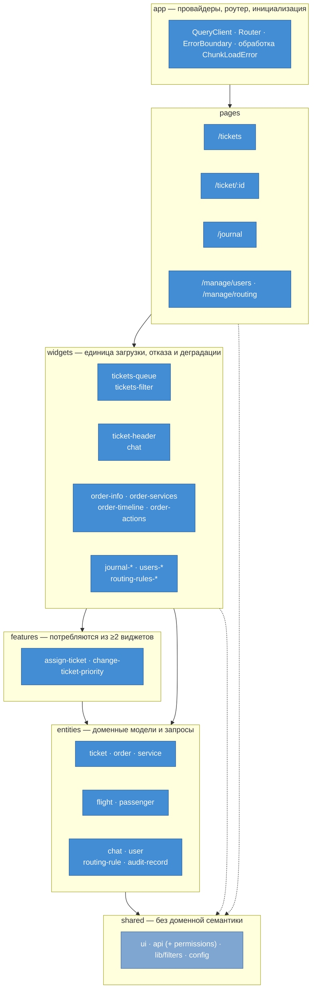

# Фронтенд-архитектура

Декомпозиция фронтенда, модель рендеринга и сборки, масштабирование и контур доставки.

Контекст системы — [README](../README.md), драйверы — [Utility Tree](utility-tree.md), компромиссы — [Trade-offs](tradeoffs.md), контейнеры — [C4 Container](c4-container.md).

**Вводные:** React + TypeScript, одна фронтенд-команда 3–6 человек, одно SPA на все роли (агент, супервайзор, администратор).

## Ключевые решения

| ADR | Решение | Причина |
|---|---|---|
| [0003](adr/0003-features-inside-widgets.md) | Фичи по умолчанию живут внутри виджетов | у большинства сценариев ровно один потребитель, а слой из двадцати срезов-однодневок дороже пользы |
| [0004](adr/0004-permissions-in-shared.md) | Права — инфраструктурный сервис в `shared` | ответ `/permissions` — плоский список строк, доменной семантики не несёт |
| [0005](adr/0005-csr-over-ssr.md) | CSR; SSR и SSG отвергнуты | SSR ускоряет загрузку документа, случающуюся раз в смену, и не влияет на открытие карточки — реальное узкое место |
| [0006](adr/0006-polling-over-push.md) | Поллинг вместо push-канала | push доставляет событие, которое можно потерять при разрыве, а [S1](utility-tree.md) требует нуля пропущенных дедлайнов |
| [0007](adr/0007-single-repo-no-microfrontends.md) | Единый репозиторий, без микрофронтендов | техническую изоляцию уже даёт code splitting, а организационная при одной команде не нужна |
| [0008](adr/0008-atomic-deploy-and-rollback.md) | Атомарный деплой, откат переключением указателя | откат через пересборку съедает четверть месячного бюджета простоя [S5](utility-tree.md) |

---

## 1. Декомпозиция: Feature-Sliced Design

Ключевая проблема фронтенда этой системы — не объём кода, а связность вокруг графа данных: заказ → сегменты рейса → пассажиры → багаж → услуги → история изменений ([S12](utility-tree.md)). FSD даёт то, чего не даёт группировка по типам файлов: правила зависимостей, проверяемые линтером, и деление по домену, а не по технической роли.

### Слои и правила границ

| Слой | Содержимое | Может импортировать |
|---|---|---|
| `app` | провайдеры, роутер, глобальные стили | всё нижележащее |
| `pages` | экран под маршрут, композиция виджетов | widgets, features, entities, shared |
| `widgets` | самостоятельный блок UI со своей загрузкой данных | features, entities, shared |
| `features` | сценарий, потребляемый из ≥2 виджетов | entities, shared |
| `entities` | бизнес-сущность: модель, запросы, представление | shared |
| `shared` | UI-кит, транспорт, утилиты — без доменной семантики | — |

1. **Импорт только вниз по слоям** — вверх и вбок запрещён.
2. **Срезы одного слоя не видят друг друга** — композиция происходит на слое выше.
3. **Public API** — срез экспортирует только через `index.ts`.
4. **Критерий выноса в `features`** — два и более потребителя ([ADR 0003](adr/0003-features-inside-widgets.md)).

Правила 1–3 контролируются линтером (`@feature-sliced/eslint-config`), иначе деградируют до пожеланий. Слой `processes` из ранних версий FSD не используется.

### Разметка

**Маршруты и точки разбиения бандла:**

| Маршрут | Роль | Композиция |
|---|---|---|
| `/tickets` | агент, супервайзор | `tickets-filter` + `tickets-queue` |
| `/ticket/:id` | агент, супервайзор | `ticket-header` + `chat` + `order-*` |
| `/journal` | супервайзор, админ | `journal-filter` + `journal-list` |
| `/manage/users` | админ | `users-filter` + `users-list` |
| `/manage/routing` | админ | `routing-rules-filter` + `routing-rules-list` |

**Виджеты** — каждый грузит данные сам и деградирует независимо, поэтому отказ одного источника не роняет карточку ([S6](utility-tree.md)):

| Виджет | Ответственность |
|---|---|
| `tickets-queue` | очередь с виртуализацией под 10 000+ ([S4](utility-tree.md)), подсветка срочных по вылету ([S2](utility-tree.md)) |
| `tickets-filter` | фильтрация и сортировка очереди |
| `ticket-header` | статус, приоритет, назначенный агент, SLA-таймер, время до вылета ([S1](utility-tree.md), [S2](utility-tree.md)) |
| `chat` | переписка с клиентом (проксирование ФОС) |
| `order-info` | заказ, сегменты рейса, пассажиры |
| `order-services` | дополнительные услуги |
| `order-timeline` | история изменений заказа |
| `order-actions` | отмена, возврат, изменение, переотправка документов |
| `journal-*` · `users-*` · `routing-rules-*` | аудит и администрирование: фильтр + список |

**Фичи.** В слое `features` — `assign-ticket` и `change-ticket-priority`: обе нужны и в очереди, и в карточке. Остальные живут внутри своих виджетов ([ADR 0003](adr/0003-features-inside-widgets.md)): в `ticket-header` — `change-ticket-status`, `close-ticket`, `escalate-ticket`; в `order-actions` — `cancel-order`, `refund-order`, `change-order`, `manage-order-services`, `resend-documents`; в `chat` — `send-message`.

Необратимые операции (`cancel-order`, `refund-order`, `close-ticket`) требуют явного подтверждения ([S13](utility-tree.md)). Сетевые вызовы всех фич живут в `entities/*/api`, поэтому `close-ticket` и `change-ticket-status` переиспользуют один вызов.

**Сущности:** `ticket` · `order` · `service` · `flight` · `passenger` · `chat` · `user` · `routing-rule` · `audit-record`.

Модель сообщения лежит **внутри** среза `chat` (`model/message.ts`), а не отдельным срезом: срезы одного слоя не видят друг друга, поэтому `entities/chat` не смог бы отрендерить список `entities/chat-message`. Отдельной жизни у сообщения и нет — тредом владеет ФОС, система его проксирует.

**Shared:** `ui` · `api` (клиент BFF, обвязка поллинга, права) · `lib/filters` (синхронизация с URL, дебаунс, сброс) · `config`.

---

## 2. Рендеринг и сборка

Три факта об эксплуатации определяют весь раздел: доступ только за SSO (индексации нет), холодная загрузка происходит **один раз за смену**, основная работа — SPA-навигация по циклу «очередь → карточка → назад».

**Модель рендеринга — CSR** ([ADR 0005](adr/0005-csr-over-ssr.md)). Первичная загрузка сознательно не оптимизируется в ущерб архитектуре; оптимизируется SPA-навигация, где живёт реальная работа агента.

### Бюджет производительности

| Метрика | Бюджет | Процентиль | Обоснование |
|---|---|---|---|
| LCP | ≤ 3.0 с | p75 | мягче стандартных 2.5 с: холодная загрузка раз в смену, корпоративные машины |
| INP | ≤ 200 мс | p75 | ключевая метрика: тысячи взаимодействий за смену под временным давлением |
| CLS | ≤ 0.1 | p75 | прогрессивный рендеринг [TO-1](tradeoffs.md) двигает макет, рядом лежат необратимые действия |
| Открытие карточки | ≤ 2 с | **p95** | [S3](utility-tree.md); Web Vitals этого не видят — собственный замер `mark`/`measure` |
| Initial JS | ≤ 300 KB gzip | — | барьер в сборке: ловит регрессию до прода |

Процентили различаются осознанно: Core Web Vitals меряются на p75 (так устроен стандарт и RUM), S3 наследуется из ДЗ-1 на p95. По [TO-1](tradeoffs.md) метрика S3 относится к **каркасу с кэшированным контекстом**, а не к последнему догруженному live-полю — иначе замер завышает результат.

Измеряется на трёх уровнях: RUM (`web-vitals` → аналитика) даёт реальные значения, Lighthouse CI ловит регрессии на синтетике, бюджет размера бандла роняет сборку.

### Стратегия сборки

Разбиение по маршрутам, асимметрично по частоте использования: `/journal` и `/manage/*` — ленивые чанки целиком; `/tickets` и `/ticket/:id` — разделены, но чанк карточки **префетчится в idle** сразу после отрисовки очереди, чтобы первый за смену клик по тикету не ждал сеть. Vendor (React, роутер, TanStack Query) вынесен отдельно: между релизами не меняется.

**Протухшие чанки.** Агент держит вкладку открытой всю смену; релиз в середине дня пересобирает ассеты с новыми хешами, и переход на ленивый маршрут даёт `ChunkLoadError` — та самая деградация, которую запрещает [S5](utility-tree.md). Смягчается с двух сторон: старые версии ассетов не удаляются ([ADR 0008](adr/0008-atomic-deploy-and-rollback.md)) и `app` обрабатывает ошибку мягкой перезагрузкой с уведомлением о новой версии.

### Обновление данных

**Поллинг** с интервалами по типу данных ([ADR 0006](adr/0006-polling-over-push.md)): уведомления 30 с, очередь 15 с, открытый чат 5 с; пауза при уходе вкладки в фон и refetch при возврате фокуса. Пиковая нагрузка при 500 агентах — около 150 rps, для BFF это фон.

Чтобы опрос не бил по БД, poll-эндпоинт возвращает маркер изменений (`max(updated_at)` по индексу); полная выборка по 10 000+ тикетов запрашивается только при сдвиге маркера.

---

## 3. Масштабирование

«Monorepo или microfrontend» — два независимых вопроса: monorepo про то, где лежит код, microfrontend про то, как приложение собирается в рантайме.

**Один репозиторий, только фронтенд, одно приложение, без микрофронтендов** ([ADR 0007](adr/0007-single-repo-no-microfrontends.md)). Модульность обеспечивают границы FSD с проверкой линтером, изоляцию загрузки — разбиение бандла.

Единственный правдоподобный кандидат на выделение — `/manage/*` — не окупается: техническая изоляция уже достигнута code splitting, а организационная при одной команде не нужна.

Следствие раздельного хранения фронтенда и BFF: контракт пересекает границу репозиториев, поэтому изменение API и его потребления нельзя выкатить одним коммитом. Смягчается генерацией типов из OpenAPI-схемы BFF в CI — ломается сборка фронтенда, а не продакшен.

---

## 4. CI/CD

```mermaid
flowchart LR
    pr["Pull<br/>Request"] --> checks

    subgraph checks["Проверки — блокируют мерж"]
        direction TB
        lint["lint<br/>+ границы FSD"]
        types["typecheck"]
        unit["unit + компонентные<br/>тесты виджетов"]
        build["build<br/>+ бюджет 300 KB"]
    end

    checks --> preview["preview<br/>эфемерное на PR"]
    preview --> lh["Lighthouse CI<br/>информационно"]
    preview --> review["ручная проверка<br/>ревьюером"]
    review --> approve["апрув"]
    approve --> merge["мерж в main"]

    merge --> stg["staging<br/>синтетические данные"]
    stg --> prod["production<br/>releases/{sha} + указатель"]
    prod -.->|"инцидент замечен"| back["ручной откат:<br/>переключение указателя"]

    classDef gate fill:#438dd5,stroke:#2e6295,color:#fff
    classDef env fill:#7fa6d1,stroke:#4d6f96,color:#fff
    classDef bad fill:#c0654e,stroke:#8f4536,color:#fff
    class lint,types,unit,build,approve gate
    class preview,stg,prod env
    class back bad
```

### Окружения

| Окружение | Жизненный цикл | Данные |
|---|---|---|
| **preview** | эфемерное: создаётся на каждый PR, удаляется при мерже | ходит в staging BFF — ревьюер, дизайнер и продакт смотрят изменения живьём, не собирая ветку локально |
| **staging** | постоянное, после мержа | синтетический seed, включая 10 000+ тикетов для проверки виртуализации ([S4](utility-tree.md)) |
| **production** | автоматически при мерже в main | — |

**Почему синтетические данные, а не выгрузка из прода.** Preview доступен по ссылке всем участникам PR; подключение его к реальным данным дало бы доступ к ПДн вне продакшена и мимо аудита — против [S9](utility-tree.md) (152-ФЗ) и [S10](utility-tree.md). Практика «дамп прода с маскированием» не подходит: обезличивание почти всегда неполное — замаскировали ФИО и паспорт, а телефон остался в комментарии агента, номер заказа позволяет сопоставить запись с человеком.

### Что блокирует мерж

Принцип — **блокирует то, что детерминировано**: lint (включая границы FSD), typecheck, тесты, сборка с бюджетом бандла, апрув ревьюера. Lighthouse CI только информирует: синтетические замеры шумят, а блокирующий флак приучает команду обходить проверки.

**E2E-тесты не заводятся.** Для команды 3–6 человек полный сквозной регресс несоразмерен: медленный прогон, флаки, постоянная поддержка. То, ради чего его обычно берут, покрывается дешевле — **компонентными тестами виджетов** (Testing Library + MSW). Это прямо следует из декомпозиции: виджет объявлен единицей загрузки, отказа и деградации, значит он же и естественная единица тестирования. Мок, отдающий 500 на один источник, проверяет [S6](utility-tree.md) без браузера и роутинга; фикстуры на разные роли — [S8](utility-tree.md); фикстура на 10 000+ записей — виртуализацию [S4](utility-tree.md).

### Выкат и откат

Прод выкатывается автоматически при мерже в `main`; откат — ручной, переключением указателя на предыдущий релиз ([ADR 0008](adr/0008-atomic-deploy-and-rollback.md)). Автоматического отката нет: он потребовал бы smoke-тестов на проде, то есть того самого E2E-инструментария, от которого отказались. Цена решения — поломка обнаруживается человеком, а не пайплайном. В объявленные пиковые периоды автовыкат отключается.

---

## Связь с атрибутами качества
| Сценарий | Как учтён |
|---|---|
| [S1](utility-tree.md) — SLA-алерт, 0 пропусков | поллинг доставляет состояние, а не событие: разрыв связи не создаёт пропуска ([ADR 0006](adr/0006-polling-over-push.md)) |
| [S2](utility-tree.md) — приоритизация по вылету | `ticket-header` и `tickets-queue`: подсветка и сортировка срочных |
| [S3](utility-tree.md) — карточка ≤ 2 с p95 | прогрессивный рендеринг по виджетам, префетч чанка карточки, собственный замер; SSR отвергнут как не адресующий сценарий ([ADR 0005](adr/0005-csr-over-ssr.md)) |
| [S4](utility-tree.md) — 500 агентов, 10 000+ | виртуализация очереди; расчёт нагрузки поллинга и маркер изменений ([ADR 0006](adr/0006-polling-over-push.md)) |
| [S5](utility-tree.md) — 99.9%, «ковры» | нет рантайма фронтенда в проде и нет рантайм-федерации ([ADR 0005](adr/0005-csr-over-ssr.md), [0007](adr/0007-single-repo-no-microfrontends.md)); откат за секунды и окно заморозки ([ADR 0008](adr/0008-atomic-deploy-and-rollback.md)) |
| [S6](utility-tree.md) — graceful degradation | виджет — единица загрузки, отказа и индикации |
| [S8](utility-tree.md) — маскирование ПДн | маскирует BFF; UI скрывает недоступные действия через `useCan` и не является механизмом защиты ([ADR 0004](adr/0004-permissions-in-shared.md)) |
| [S9](utility-tree.md) — 152-ФЗ | ПДн не рендерятся в HTML ([ADR 0005](adr/0005-csr-over-ssr.md)); в preview и staging только синтетические данные |
| [S10](utility-tree.md) — аудит действий | необратимые операции идут через BFF, который пишет событие; preview не даёт доступа к ПДн мимо аудита |
| [S12](utility-tree.md) — 2–3 шага по графу | структура маршрутов, композиция виджетов карточки, префетч чанка |
| [S13](utility-tree.md) — подтверждение необратимых | `cancel-order`, `refund-order`, `close-ticket` с подтверждением; бюджет CLS против промахов по кнопке |
| [TO-1](tradeoffs.md) — скорость ↔ свежесть | каркас из кэша сразу, live-поля в своих блоках; интервалы поллинга по типу данных |
