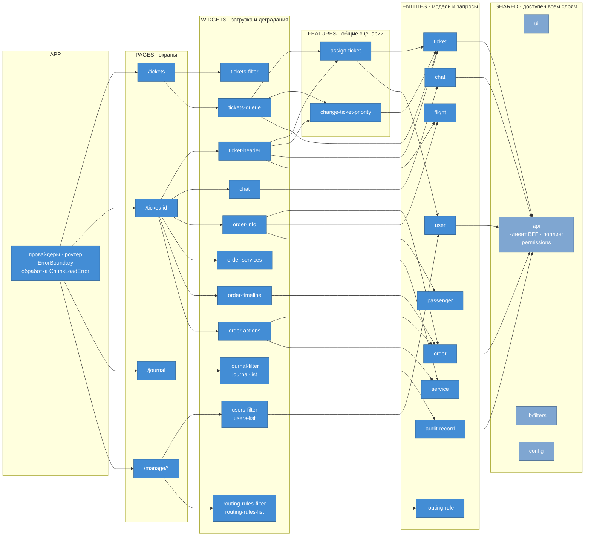
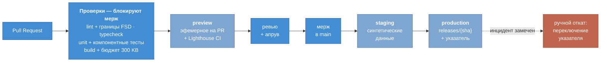

# Фронтенд-архитектура

Декомпозиция фронтенда, модель рендеринга и сборки, масштабирование и контур доставки.

Контекст — [README](../README.md), драйверы — [Utility Tree](utility-tree.md), компромиссы — [Trade-offs](tradeoffs.md), контейнеры — [C4 Container](c4-container.md).

**Вводные:** React + TypeScript, одна фронтенд-команда 3–6 человек, одно SPA на все роли (агент, супервайзор, администратор).

## Ключевые решения

| ADR | Решение | Причина |
|---|---|---|
| [0003](adr/0003-features-inside-widgets.md) | Фичи по умолчанию живут внутри виджетов | у большинства сценариев ровно один потребитель, слой из двадцати срезов-однодневок дороже пользы |
| [0004](adr/0004-permissions-in-shared.md) | Права — инфраструктурный сервис в `shared` | ответ `/permissions` — плоский список строк, доменной семантики не несёт |
| [0005](adr/0005-csr-over-ssr.md) | CSR; SSR и SSG отвергнуты | система внутренняя и за SSO — индексация не нужна, а рендеринг на сервере добавил бы точку отказа в проде ради пары сотен миллисекунд на первой загрузке и нуля на последующих |
| [0006](adr/0006-polling-over-push.md) | Поллинг вместо push-канала | опрос возвращает состояние целиком, поэтому обрыв связи не превращается в пропущенный дедлайн ([S1](utility-tree.md)) |
| [0007](adr/0007-single-repo-no-microfrontends.md) | Единый репозиторий, без микрофронтендов | техническую изоляцию уже даёт code splitting, организационная при одной команде не нужна |
| [0008](adr/0008-atomic-deploy-and-rollback.md) | Атомарный деплой, откат переключением указателя | предыдущая версия возвращается за секунды, а не за прогон пайплайна — при бюджете простоя 44 минуты в месяц это решающе ([S5](utility-tree.md)) |

---

## 1. Декомпозиция: Feature-Sliced Design

Главная проблема фронтенда здесь — не объём кода, а связность вокруг графа данных «заказ → сегменты рейса → пассажиры → багаж → услуги → история» ([S12](utility-tree.md)). FSD даёт правила зависимостей, проверяемые линтером, и деление по домену, а не по технической роли.

```mermaid
flowchart LR
    subgraph app["APP"]
        a1["провайдеры · роутер<br/>ErrorBoundary<br/>обработка ChunkLoadError"]
    end

    subgraph pages["PAGES · экраны"]
        p1["/tickets"]
        p2["/ticket/:id"]
        p3["/journal"]
        p4["/manage/*"]
    end

    subgraph widgets["WIDGETS · загрузка и деградация"]
        w1["tickets-filter"]
        w2["tickets-queue"]
        w3["ticket-header"]
        w4["chat"]
        w5["order-info"]
        w6["order-services"]
        w7["order-timeline"]
        w8["order-actions"]
        w9["journal-filter<br/>journal-list"]
        w10["users-filter<br/>users-list"]
        w11["routing-rules-filter<br/>routing-rules-list"]
    end

    subgraph features["FEATURES · общие сценарии"]
        f1["assign-ticket"]
        f2["change-ticket-priority"]
    end

    subgraph entities["ENTITIES · модели и запросы"]
        e1["ticket"]
        e2["order"]
        e3["service"]
        e4["flight"]
        e5["passenger"]
        e6["chat"]
        e7["user"]
        e8["routing-rule"]
        e9["audit-record"]
    end

    subgraph shared["SHARED · доступен всем слоям"]
        s1["ui"]
        s2["api<br/>клиент BFF · поллинг<br/>permissions"]
        s3["lib/filters"]
        s4["config"]
    end

    a1 --> p1
    a1 --> p2
    a1 --> p3
    a1 --> p4

    p1 --> w1
    p1 --> w2
    p2 --> w3
    p2 --> w4
    p2 --> w5
    p2 --> w6
    p2 --> w7
    p2 --> w8
    p3 --> w9
    p4 --> w10
    p4 --> w11

    w2 --> f1
    w2 --> f2
    w3 --> f1
    w3 --> f2

    w2 --> e1
    w3 --> e1
    w3 --> e4
    w4 --> e6
    w5 --> e2
    w5 --> e4
    w5 --> e5
    w6 --> e3
    w7 --> e2
    w8 --> e2
    w8 --> e3
    w9 --> e9
    w10 --> e7
    w11 --> e8

    f1 --> e1
    f1 --> e7
    f2 --> e1

    e1 --> s2
    e2 --> s2
    e6 --> s2
    e7 --> s2
    e9 --> s2

    classDef layer fill:#438dd5,stroke:#2e6295,color:#fff
    classDef sh fill:#7fa6d1,stroke:#4d6f96,color:#fff
    class a1,p1,p2,p3,p4,w1,w2,w3,w4,w5,w6,w7,w8,w9,w10,w11,f1,f2,e1,e2,e3,e4,e5,e6,e7,e8,e9 layer
    class s1,s2,s3,s4 sh
```

Слои идут слева направо, зависимости — в ту же сторону. У `ui`, `lib/filters` и `config` входящие стрелки не нарисованы намеренно: этими модулями пользуются все слои, и рисовать связи означало бы соединить каждый узел с каждым.

### Правила границ

1. **Импорт только в нижележащие слои** (на схеме — правее). Обратно и вбок запрещён.
2. **Срезы одного слоя не видят друг друга** — композиция происходит на слое выше.
3. **Public API** — срез экспортирует только через `index.ts`.
4. **Критерий выноса в `features`** — два и более потребителя ([ADR 0003](adr/0003-features-inside-widgets.md)).

Правила 1–3 контролируются линтером (`@feature-sliced/eslint-config`), иначе деградируют до пожеланий. Слой `processes` из ранних версий FSD не используется.

### Разметка

| Маршрут | Роль | Композиция |
|---|---|---|
| `/tickets` | агент, супервайзор | `tickets-filter` + `tickets-queue` |
| `/ticket/:id` | агент, супервайзор | `ticket-header` + `chat` + `order-*` |
| `/journal` | супервайзор, админ | `journal-filter` + `journal-list` |
| `/manage/users` · `/manage/routing` | админ | фильтр + список |

**Виджеты** — единица отказа, индикации и тестирования: недоступный блок помечается и не роняет карточку ([S6](utility-tree.md)); действия, небезопасные без его данных, при этом неактивны с пояснением. Но **не единица запроса**: ядро контекста приходит одним ответом, виджеты ядра читают из него по ключу и собственных обращений не делают. Свой запрос виджет выполняет только за медленным блоком — там же, где ему нужен локальный лоадер ([ADR 0010](adr/0010-single-endpoint-per-card.md)). Архитектурно нагруженные: `tickets-queue` — виртуализация под 10 000+ ([S4](utility-tree.md)) и подсветка срочных по признаку `deadline_reason`, сортировка приходит готовой с бэкенда ([S2](utility-tree.md)); `ticket-header` — статус, приоритет, SLA-таймер, время до вылета ([S1](utility-tree.md), [S2](utility-tree.md)); `chat` — лента обращения: сообщения клиента проксируются через ФОС и системе не принадлежат, внутренние заметки и системные события — свои.

**Фичи.** В слое `features` только `assign-ticket` и `change-ticket-priority` — обе нужны и в очереди, и в карточке. Остальные живут внутри своих виджетов ([ADR 0003](adr/0003-features-inside-widgets.md)): смена статуса, закрытие и эскалация — в `ticket-header`; отмена, возврат, изменение заказа, услуги и документы — в `order-actions`; отправка сообщения — в `chat`. Необратимые операции требуют явного подтверждения ([S13](utility-tree.md)). Сетевые вызовы всех фич живут в `entities/*/api`, поэтому `close-ticket` и `change-ticket-status` переиспользуют один вызов.

**Сущности.** Модель записи ленты лежит внутри среза `chat`, а не отдельным срезом: срезы одного слоя не видят друг друга, поэтому `entities/chat` не смог бы отрендерить ленту. Запись ленты — это сообщение клиента, внутренняя заметка или системное событие; единственный из трёх типов, которым система не владеет, — сообщения клиента, они живут в ФОС.

---

## 2. Рендеринг и сборка

Раздел определяют три факта об эксплуатации: доступ только за SSO — индексации нет; основная работа — SPA-навигация по циклу «очередь → карточка → назад»; но в карточку попадают и **холодным заходом по прямой ссылке** — из уведомления, из чата, перезагрузкой вкладки, открытием в новой. Такой вход подчиняется тому же бюджету открытия карточки, что и переход из очереди, и не считается отдельной «первичной загрузкой».

**Модель рендеринга — CSR** ([ADR 0005](adr/0005-csr-over-ssr.md)): первичная загрузка оптимизируется, но только средствами, которые не добавляют рантайма в прод — составом ядра бандла, скелетоном прямо в `index.html` и кэшированием ассетов по контент-хешам. Холодный заход в карточку укладывается в те же 2 с, что и переход из очереди.

| Метрика | Бюджет | Процентиль | Обоснование |
|---|---|---|---|
| LCP | ≤ 3.0 с | p75 | мягче стандартных 2.5 с: слабые машины корпоративного парка; горячий путь при этом закрыт более жёстким бюджетом карточки |
| INP | ≤ 200 мс | p75 | ключевая метрика: тысячи взаимодействий за смену под временным давлением |
| CLS | ≤ 0.1 | p75 | блоки карточки догружаются и двигают макет, а рядом лежат необратимые действия |
| Каркас виден | ≤ 1 с | p95 | диагностическая: защита от белого экрана, не бюджет [S3](utility-tree.md) |
| **Ядро контекста карточки** | **≤ 2 с** | **p95** | это и есть [S3](utility-tree.md); Web Vitals не видят переходов внутри SPA — нужен собственный замер `mark`/`measure`, в выборку входят оба пути входа |
| Полнота карточки | ≤ 4 с | p95 | live-поля и периферия; таймаут блока — 5 с |
| Вкладка карточки | ≤ 1 с | p95 | клик → данные на экране; индикатор ≤ 100 мс, повторное переключение без запроса. Одна мера на все вкладки: источники у них разные, но обязательство по времени одно. Вкладка, потянувшая живой внешний источник, получает собственную меру ([ADR 0010](adr/0010-single-endpoint-per-card.md)) |
| Initial JS | ≤ 300 KB gzip | — | барьер в сборке: ловит регрессию до прода |

Процентили различаются осознанно: Core Web Vitals меряются на p75 по стандарту, а требование к открытию карточки наследуется из ДЗ-1 на p95 ([S3](utility-tree.md)).

### Что значит «карточка открылась»

Одного числа у прогрессивного интерфейса быть не может: ядро приходит одним ответом, а медленные блоки догружаются позже и финишируют не одновременно. Поэтому веха определена **составом полей**, а не словом «каркас» — описание словами уползёт при первом же рефакторинге.

| Веха | Достигнута, когда | Бюджет |
|---|---|---|
| Каркас виден | отрисован скелетон из `index.html`; данных нет | ≤ 1 с |
| **Ядро контекста** | отрисованы номер, тема и статус тикета, приоритет, `deadline_at` и `deadline_reason`, лента обращения, содержимое вкладки по умолчанию — всё, что видно на экране сразу, одним ответом ([ADR 0001](adr/0001-caching-per-data-type.md), [ADR 0010](adr/0010-single-endpoint-per-card.md)) | **≤ 2 с** |
| Полнота | все блоки в терминальном состоянии: данные **или** явная метка «нет данных» | ≤ 4 с |

Границы выбраны так, потому что обе крайности не работают. Останавливать секундомер на **скелетоне** нельзя: метрика закрывалась бы отрисовкой серых плашек, при которых агент работать не может. Останавливать на **последнем догруженном блоке** — тоже: часть блоков читается live из внешних источников, а [S6](utility-tree.md) прямо допускает их полный отказ, и тогда метрика не определена вовсе. Метрика, которая может быть бесконечной, — не метрика; поэтому терминальным состоянием блока объявлены «данные *или* метка „нет данных“», и мера полноты оказывается привязана к деградации, а не живёт отдельно от неё.

Выбор одного hero-блока вместо «всё загрузилось» согласуется с логикой Core Web Vitals: LCP тоже не ждёт полной загрузки, а берёт крупнейший контентный элемент.

**Почему 2 с достижимы.** Раскладка холодного захода по прямой ссылке, p95 — оценки под валидацию на RUM, не измерения. Ожидания последовательны: запрос контекста уходит, когда смонтировался маршрут карточки. Столбцы различаются состоянием кэша ассетов, и это разные события: холодный **документ** — рутина, холодный **кэш** — первый заход за смену и первый после релиза.

| Шаг | Первый заход за смену | Повторный холодный заход |
|---|---|---|
| `index.html` + пейнт скелетона | ~250 мс | ~80 мс (`304`, тело из кэша) |
| бандл 300 KB gzip: доставка, парс, первый рендер | ~650 мс | ~350 мс (с диска, без сети) |
| BFF, ядро из кэша | 300–600 мс | 300–600 мс |
| рендер полученных данных | ~150 мс | ~150 мс |
| **итого** | **~1.65 с** | **~1.2 с** |

Худший случай — первый заход за смену: ~1.65 с при бюджете 2 с, запас около 350 мс. Тёплый переход из очереди достигает той же вехи за 500–750 мс. p95 формируют холодные заходы, но преимущественно повторные, а не первый за смену: их кратно больше. Запас невелик, и если он начнёт съедаться, первым рычагом идут `103 Early Hints` с `preload` ассетов ([ADR 0005](adr/0005-csr-over-ssr.md)), а не SSR.

Live-тир (статус и время рейса живьём из внешнего источника, [ADR 0001](adr/0001-caching-per-data-type.md)) добавляет 0.8–2 с и приезжает к 2.2–3 с: именно он не уложился бы в 2 с при замере «до последнего поля», поэтому у него свой бюджет и таймаут, а не общий с ядром.

**Что входит в выборку.** Оба пути входа: тёплый переход из очереди (отсчёт от клика) и холодный заход по ссылке (отсчёт от `navigationStart`). Исключать холодные заходы нельзя: их доля почти наверняка больше 5%, а значит именно они и составили бы p95 — метрика превратилась бы в замер того, что из неё вырезали. RUM размечает каждый замер типом входа, чтобы доля была видна в данных, а не предполагалась. Измеряется на трёх уровнях: RUM в проде, Lighthouse CI на синтетике, бюджет бандла на сборке.

**Разбиение бандла — не по маршрутам, а по оси «ядро / периферия».** Разбиение по маршрутам ставит карточку в ленивый чанк, и уложиться в бюджет удаётся только префетчем — то есть лишь для входа из очереди. Холодный заход при этом собирает три последовательных ожидания: бандл → чанк маршрута → запрос данных, каждое ждёт предыдущего. Поэтому:

| Что | Куда | Почему |
|---|---|---|
| `app`, `shared`, `entities`, виджеты очереди и карточки | **ядро**, в основной бандл | 95% рабочего времени агента; грузится один раз при любом пути входа, префетч не нужен в принципе |
| `/journal`, `/manage/*` | ленивые чанки | редкие роли и редкие заходы, задержка терпима |
| тяжёлое **внутри** карточки: просмотрщик документов, вложения чата | ленивые чанки внутри виджета | не блокируют ядро; виджет уже объявлен единицей загрузки и деградации, у него свой скелетон |
| vendor | отдельный чанк | переживает релизы в кэше браузера |

Этим убирается **второе** ожидание из цепочки: маршрут карточки лежит в том же файле, который и так качается, поэтому шага «роутер выполнился и только теперь узнал, какой чанк нужен» не возникает. Третье — запрос контекста — уходит из `loader` маршрута, то есть до рендера компонента, а не из смонтированного виджета. Скелетон при этом живёт прямо в `index.html`: приезжающий вместе с бандлом, он не закрывает тот белый экран, ради которого заведён ([ADR 0005](adr/0005-csr-over-ssr.md)).

Префетч — необязательная оптимизация: в idle подтягиваются ленивые чанки под роль пользователя. **Ни один бюджет на него не опирается.**

Релиз в середине дня пересобирает ассеты, и давно открытая вкладка получает `ChunkLoadError` при переходе на ленивый маршрут — поэтому старые версии не удаляются ([ADR 0008](adr/0008-atomic-deploy-and-rollback.md)), а `app` обрабатывает ошибку мягкой перезагрузкой. Самый горячий маршрут при этом в ленивых чанках не лежит и этому классу отказов не подвержен.

**Обновление данных — поллинг** ([ADR 0006](adr/0006-polling-over-push.md)): уведомления 30 с, очередь 15 с, открытый чат 5 с, пауза при уходе вкладки в фон. При 500 агентах — около 150 rps. Чтобы опрос не бил по БД, poll-эндпоинт возвращает маркер изменений по индексу, а полная выборка идёт только при его сдвиге.

---

## 3. Масштабирование

«Monorepo или microfrontend» — два независимых вопроса: monorepo про то, где лежит код, microfrontend про то, как приложение собирается в рантайме.

**Один репозиторий, только фронтенд, одно приложение, без микрофронтендов** ([ADR 0007](adr/0007-single-repo-no-microfrontends.md)). Модульность обеспечивают границы FSD, изоляцию загрузки — разбиение бандла. Единственный кандидат на выделение, `/manage/*`, не окупается: техническую изоляцию уже даёт code splitting, а организационная при одной команде не нужна.

Следствие раздельного хранения с BFF: контракт пересекает границу репозиториев, поэтому изменение API и его потребления нельзя выкатить одним коммитом. Смягчается генерацией типов из OpenAPI-схемы в CI — ломается сборка фронтенда, а не продакшен.

---

## 4. CI/CD

```mermaid
flowchart LR
    pr["Pull Request"] --> checks["<b>Проверки — блокируют мерж</b><br/>lint + границы FSD · typecheck<br/>unit + компонентные тесты<br/>build + бюджет 300 KB"]
    checks --> preview["<b>preview</b><br/>эфемерное на PR<br/>+ Lighthouse CI"]
    preview --> approve["ревью<br/>+ апрув"]
    approve --> merge["мерж<br/>в main"]
    merge --> stg["<b>staging</b><br/>синтетические<br/>данные"]
    stg --> prod["<b>production</b><br/>releases/{sha}<br/>+ указатель"]
    prod -.->|"инцидент замечен"| back["ручной откат:<br/>переключение<br/>указателя"]

    classDef gate fill:#438dd5,stroke:#2e6295,color:#fff
    classDef env fill:#7fa6d1,stroke:#4d6f96,color:#fff
    classDef bad fill:#c0654e,stroke:#8f4536,color:#fff
    class pr,checks,approve,merge gate
    class preview,stg,prod env
    class back bad
```

| Окружение | Жизненный цикл | Данные |
|---|---|---|
| **preview** | эфемерное: создаётся на PR, удаляется при мерже | ходит в staging BFF — ревьюер смотрит изменения живьём, не собирая ветку локально |
| **staging** | постоянное, после мержа | синтетический seed, включая 10 000+ тикетов для проверки виртуализации ([S4](utility-tree.md)) |
| **production** | автоматически при мерже в main | — |

**Данные только синтетические.** Preview доступен по ссылке всем участникам PR, поэтому реальные данные означали бы доступ к персональным данным вне продакшена и мимо аудита — это нарушает и требование локализации ПДн по 152-ФЗ ([S9](utility-tree.md)), и требование фиксировать каждый просмотр ПДн в журнале ([S10](utility-tree.md)). Дамп прода с маскированием не подходит: обезличивание почти всегда неполное — телефон остаётся в комментарии агента, номер заказа позволяет сопоставить запись с человеком.

**Гейты.** Блокирует то, что детерминировано: lint с границами FSD, typecheck, тесты, бюджет бандла, апрув ревьюера. Lighthouse CI только информирует — синтетические замеры шумят, а блокирующий флак приучает обходить проверки.

**E2E не заводятся**: для команды 3–6 человек сквозной регресс несоразмерен. То, ради чего его берут, покрывают компонентные тесты виджетов (Testing Library + MSW) — виджет объявлен единицей отказа, значит он же единица тестирования. Мок, отдающий ошибку на один источник, проверяет деградацию карточки без браузера и роутинга ([S6](utility-tree.md)); фикстуры на разные роли проверяют, что недоступные действия скрыты ([S8](utility-tree.md)).

**Выкат и откат.** Прод выкатывается автоматически при мерже в `main`; откат ручной, переключением указателя ([ADR 0008](adr/0008-atomic-deploy-and-rollback.md)). Автоматического отката нет — он потребовал бы smoke-тестов на проде, то есть отвергнутого E2E-инструментария; цена в том, что поломку замечает человек, а не пайплайн. В объявленные пиковые периоды автовыкат отключается.

---

## Связь с атрибутами качества

| Требование из ДЗ-1 | Как учтён |
|---|---|
| Алерт о дедлайне, ни одного пропуска ([S1](utility-tree.md)) | поллинг доставляет состояние, а не событие: разрыв связи не создаёт пропуска ([ADR 0006](adr/0006-polling-over-push.md)) |
| Срочные по времени вылета подняты в очереди ([S2](utility-tree.md)) | подсветка и сортировка в `tickets-queue`, таймер до вылета в `ticket-header` |
| Ядро контекста карточки за 2 секунды ([S3](utility-tree.md)) | карточка в ядре бандла — на холодном заходе нет round trip на поиск чанка; ядро отдаётся из кэша BFF ([ADR 0001](adr/0001-caching-per-data-type.md)); бюджет останавливается на перечисленном составе полей, полнота вынесена в отдельную меру ≤ 4 с; держится на обоих путях входа, включая заход по прямой ссылке ([ADR 0005](adr/0005-csr-over-ssr.md)) |
| Границы применимости: 500 агентов, очередь 10 000+ ([S4](utility-tree.md)) | виртуализация очереди; маркер изменений вместо полной выборки при опросе ([ADR 0006](adr/0006-polling-over-push.md)) |
| Доступность 99.9%, в пики без деградации ([S5](utility-tree.md)) | нет рантайма фронтенда в проде и нет рантайм-федерации ([ADR 0005](adr/0005-csr-over-ssr.md), [0007](adr/0007-single-repo-no-microfrontends.md)); откат за секунды, заморозка выката в пики ([ADR 0008](adr/0008-atomic-deploy-and-rollback.md)) |
| Отказ источника не роняет карточку ([S6](utility-tree.md)) | виджет — единица отказа и индикации: недоступный блок помечается, соседние работают; действия, небезопасные без этих данных (ответ клиенту, закрытие тикета без ленты), неактивны с пояснением причины |
| Чувствительные поля скрыты от лишних ролей ([S8](utility-tree.md)) | маскирует BFF; интерфейс лишь не рисует недоступные действия через `useCan` ([ADR 0004](adr/0004-permissions-in-shared.md)) |
| Персональные данные только в РФ, 152-ФЗ ([S9](utility-tree.md)) | в preview и staging только синтетические данные; фронтенд — статика без рантайма, поэтому обработка ПДн целиком остаётся за BFF в контуре РФ ([ADR 0005](adr/0005-csr-over-ssr.md)) |
| Просмотры ПДн и действия попадают в аудит ([S10](utility-tree.md)) | необратимые операции идут через BFF, который пишет событие; preview не даёт доступа к данным мимо аудита |
| До любой части графа тикета 2–3 шага ([S12](utility-tree.md)) | структура маршрутов, композиция виджетов карточки; очередь и карточка лежат в одном ядре, поэтому переходы между ними сети не ждут |
| Необратимое действие требует подтверждения ([S13](utility-tree.md)) | подтверждение на отмене, возврате и закрытии; бюджет CLS защищает от промаха по кнопке |
| Скорость против свежести данных ([TO-1](tradeoffs.md)) | ядро из кэша сразу, live-поля догружаются в своих блоках под отдельным бюджетом и таймаутом; интервалы опроса разные по типу данных |
