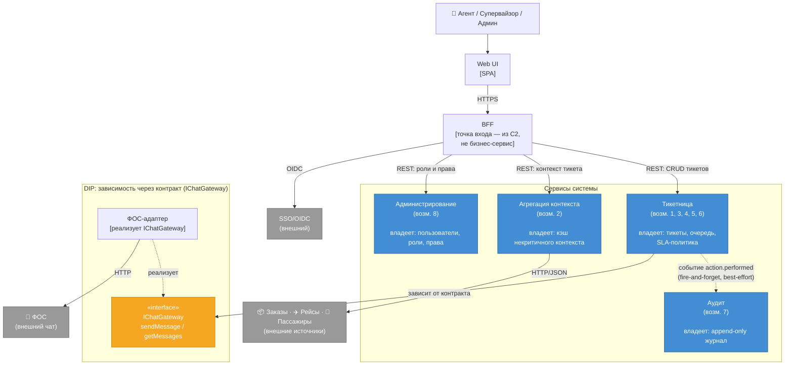

# Декомпозиция на сервисы (DDD)

Документ применяет аппарат занятия «Модели аллокации ответственности. DDD. Паттерны декомпозиции» к теме сквозного проекта — enterprise-админке саппорта сервиса продажи авиабилетов. Контекст системы — см. [README](../README.md), драйверы — [Utility Tree](utility-tree.md), контейнеры — [C4 Container](c4-container.md).

Документ идёт четырьмя шагами: возможности и поддомены → границы сервисов → проверка cohesion/coupling → карта сервисов и приём SOLID.

---

## Рамка: что и относительно чего классифицируем

Классификация core / supporting / generic **относительна выбранной рамки**, а не абсолютна.

- **Относительно всего бизнеса авиакомпании** система в целом — **supporting-домен**: она обслуживает основной продукт (продажу билетов), но сама билетов не продаёт и отдельно не продаётся. Это не core бизнеса и не generic (готовым под авиа-специфику не купить.
- **Ниже мы декомпозируем систему как самостоятельную рамку** и внутри неё выделяем свой core / supporting / generic. «Core-возможность» ниже читается как «ядро **этой** системы», а не «ядро всего бизнеса».

---

## Шаг 1. Бизнес-возможности и поддомены

Возможности сформулированы от бизнес-действия (что система умеет **для бизнеса**), а не от технического слоя. Линейка разметки:

- **Core** — то, ради чего систему строят своими силами, а не берут готовой; уникальная доменная логика, конкурентное преимущество.
- **Supporting** — специфично для домена и нужно для работы core, но само по себе не преимущество; готовым ровно под себя не купишь.
- **Generic** — решённая индустрией проблема, берётся готовой и не кастомизируется под домен.

| # | Возможность | Ответственность (одной фразой) | Класс | Почему |
|---|---|---|---|---|
| 1 | **Ведение обращения** | Жизненный цикл тикета от создания до закрытия, управление данными и статусом | **Core** | Стержень системы — механизм учёта обращений, без которого остальной функционал не имеет смысла |
| 2 | **Агрегация контекста вокруг обращения** | Сбор данных из внешних источников (заказы, рейсы, услуги) в единую картину | **Core** | Позволяет понять ситуацию клиента и прийти к верному решению; именно ради неё не взяли готовое решение (S14, S15) |
| 3 | **Маршрутизация обращений** | Распределение заявок между линиями поддержки и агентами | **Core** | Разные ситуации требуют разных навыков; направление тикета «в нужные руки» — часть доменной ценности быстрого решения |
| 4 | **Двустороннее общение с клиентом** | Приём и отправка сообщений клиенту (проксирование через чат-сервис ФОС) | **Supporting** | Лишь один из каналов ответа и проксирование чужого сервиса; полезно, но не ключевое и не единственное |
| 5 | **Приоритизация и SLA-контроль по времени** | Авто-подъём срочных по времени вылета в очереди + алерты за N часов до дедлайна | **Core** | Не пропустить и подсветить срочные тикеты — авиа-специфика time-sensitivity, прямое попадание в главный бизнес-риск (S1, S2) |
| 6 | **Мониторинг работы саппорта** | Метрики качества и скорости обработки для супервайзора | **Supporting** | Полезно для развития процессов и оптимизации, но надстройка над основным потоком, а не сама ценность |
| 7 | **Аудит действий** | Неизменяемый журнал значимых действий «кто / что / когда» | **Supporting** | Требование compliance (152-ФЗ) и расследований; обслуживает закон и доверие, не основную ценность. Не generic: что считать значимым событием — диктует домен (S10) |
| 8 | **Администрирование** | Управление пользователями, ролями и правами | **Supporting** | Механизм RBAC типовой, но набор ролей и правила доступа к ПДн специфичны для домена (S8) — готовым не купишь; нужно для core, но не преимущество |
| 9 | **Аутентификация** | Проверка личности/сессии пользователя через внешний провайдер | **Generic** | Готовый инструмент (внешний IdP, OIDC); проблема решена индустрией единообразно, под домен не кастомизируется |

**Свод.** Ядро системы — возможности **1, 2, 3, 5**: «вести обращение + собрать вокруг него контекст + направить в нужные руки + не пропустить по времени». Это связный сгусток вокруг одной идеи — **обработка обращения с полным контекстом под временным давлением**. Именно он отличает систему от готового helpdesk. Supporting (4, 6, 7, 8) обслуживает это ядро; generic (9) потребляется извне.

---

## Шаг 2. Границы сервисов

Группировка по принципу **by Business Capability**: возможности с одной причиной изменения и одними данными → один сервис. Границы — не по техническим слоям (не «база», не «API»), а по бизнес-ответственности. У каждого сервиса — **свои** данные; общей БД «на всех» нет.

**Примечание о BFF.** В C4 Container (C2) BFF выделен как единица развёртывания — одно приложение, которое физически исполняет и агрегацию, и проксирование общения, и проверку прав. На уровне бизнес-возможностей это разные ответственности с разными причинами изменения. Деплоить их вместе или раздельно — отдельное решение (C2); здесь мы работаем с логическими границами.

| Сервис | Возможности | Ответственность | Владеет |
|---|---|---|---|
| **Тикетница** | 1, 3, 4, 5, 6 | Управление жизненным циклом обращений: статусы, маршрутизация по линиям поддержки, разметка срочных по времени вылета, мониторинг метрик для супервайзора | Данные обращений: тикеты, статусы, очередь, назначения, SLA-политика |
| **Агрегация контекста** | 2 | Сбор контекста тикета из внешних источников (заказы, рейсы, пассажиры/услуги) и приведение к единой внутренней модели | Кэш некритичного контекста (имя пассажира, история заказа и др.) — производные данные, не источник истины |
| **Аудит** | 7 | Приём событий от других сервисов и запись в неизменяемый append-only журнал «кто / что / когда» | Append-only журнал действий пользователей; только запись, никаких update/delete |
| **Администрирование** | 8 | Управление пользователями, ролями и правами доступа (в т.ч. к ПДн) | Данные пользователей, ролей и политик прав доступа |

**Что вне карты.** Аутентификация (9) — внешняя зависимость (IdP, OIDC): система её потребляет, а не реализует. Отдельного сервиса в нашей карте нет.

---

## Шаг 3. Проверка cohesion / coupling

### Сплочённость (cohesion)

Каждый сервис меняется ровно по одной причине — и только он один.

**Тикетница** — меняется когда меняется логика работы с обращением: новые статусы, правила маршрутизации, логика приоритизации по времени вылета, метрики мониторинга для супервайзора. Всё это — домен обращений. Изменения в администрировании, агрегации или аудите тикетницу не затрагивают.

**Агрегация контекста** — меняется когда появляется новый внешний источник данных или меняется формат существующего. Бизнес-логика тикетницы её не трогает — она только отвечает на вопрос «дай контекст по этому тикету».

**Аудит** — меняется только когда нужно логировать новые типы действий или менять формат/срок хранения журнала. Ему всё равно, что произошло с тикетом по бизнес-смыслу — он просто получает событие и пишет. Добавили новое поле в тикет → тикетница меняется, аудит — нет.

**Администрирование** — меняется когда появляются новые роли, правила доступа к ПДн или новые типы пользователей. Логика обращений его не касается.

### Риски связанности (coupling) и способы снятия

**Риск 1. Чат (ФОС) внутри тикетницы — смена протокола ломает ядро.**

Тикетница и ФОС меняются по разным причинам: тикетница — от изменения логики обращений, ФОС — от смены протокола/API внешнего чат-сервиса другой команды. Если компонент общения с клиентом сидит напрямую внутри тикетницы, любое изменение ФОС требует правки ядра.

Снимается **контрактом**: тикетница зависит от интерфейса `IChatGateway` с операциями `sendMessage(ticketId, text)` и `getMessages(ticketId)`. За интерфейсом живёт адаптер ФОС. Поменялся протокол ФОС → меняется только адаптер, тикетница не трогается. Это пример DIP — см. шаг 4.

**Риск 2. Аудит — падение сервиса роняет тикетницу.**

Если тикетница вызывает аудит синхронно (HTTP-запросом), то недоступность аудита блокирует запись действий и может каскадом влиять на основной поток. А ответные данные от аудита тикетнице не нужны.

Снимается **событием**: тикетница публикует событие `action.performed` (fire-and-forget), аудит подписывается и пишет независимо. Редкая потеря записи при сбое допустима — это осознанное решение из [S10](utility-tree.md): «доставка — best-effort; критична неизменяемость уже записанного, а не абсолютная полнота потока». Тикетница не знает про аудит, аудит не знает про внутренности тикетницы.

---

## Шаг 4. Карта сервисов и пример DIP

### Диаграмма



### Пример DIP (Dependency Inversion Principle)

**Что:** тикетница зависит от абстракции `IChatGateway`, а не от конкретной реализации ФОС.

```
Тикетница  →  «interface» IChatGateway  ←  ФОС-адаптер  →  ФОС
 (высокий уровень)   (абстракция)          (низкий уровень)   (внешний)
```

**Почему это DIP:** высокоуровневый модуль (тикетница, бизнес-логика) не зависит от низкоуровневого (адаптера конкретного чат-сервиса). Оба зависят от абстракции — интерфейса `IChatGateway`.

**Что это даёт:** ФОС поменял протокол или формат API → меняется только адаптер, тикетница не трогается. Хотим поддержать второй канал общения — добавляем новый адаптер за тем же интерфейсом, ядро не знает об этом.
