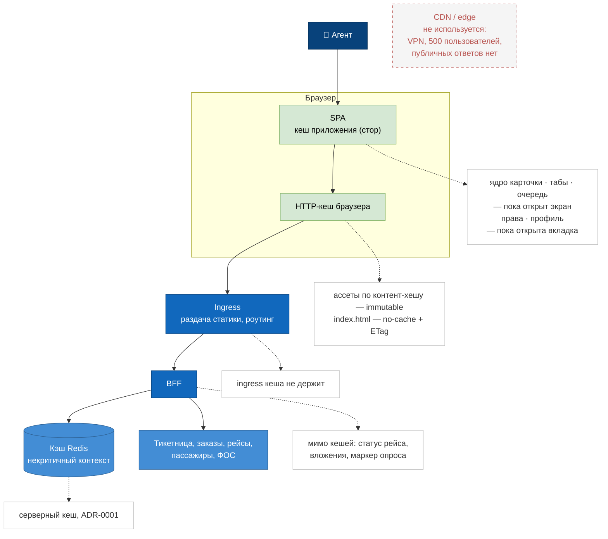
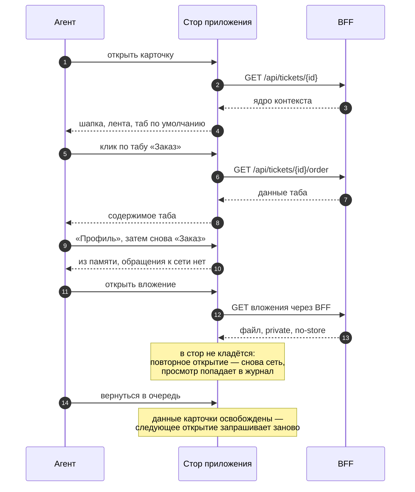

# Точки кеширования: схема

Две диаграммы. Первая отвечает на вопрос задания «где по пути запроса оседает ответ». Вторая показывает то, чего на статической схеме не видно: основной клиентский кеш системы живёт не в браузере, а в памяти приложения, и его сроком является жизнь экрана.

Разметка данных по точкам разобрана в [cache-points.md](../cache-points.md), стратегии — в [cache-invalidation.md](../cache-invalidation.md), серверный тир записан в [ADR-0001](../adr/0001-caching-per-data-type.md).

## Путь запроса и точки, где ответ оседает

Зелёным отмечены две клиентские точки. Существенно, что они разные: в HTTP-кеш попадают только ассеты и документ, который на них ссылается, а всё остальное, что агент видит повторно, лежит в памяти приложения и в кешах на пути не оставляет следа.

Краевой узел показан отдельно и красным пунктиром: его в системе нет. Это результат разметки, а не пропуск на схеме — краевой кеш имеет смысл при распределённой аудитории и публичных ответах, здесь нет ни того, ни другого.

Ingress кеша не держит намеренно: по [entry-layer.md](../entry-layer.md#граница-ответственности) на нём размещается то, что одинаково для любого запроса, — маршрутизация и сквозные политики, а не хранение ответов.

## Зум: жизнь данных на клиенте

Статическая схема не показывает главного: одни и те же данные при первом и повторном обращении проходят разный путь. Развёртка по времени показывает, где сеть не трогается вовсе и чем ограничен срок хранения.

Третий обмен — то, ради чего клиентский кеш вообще существует: повторное переключение таба выполняется без запроса ([ADR-0010](../adr/0010-single-endpoint-per-card.md)). Окно устаревания при этом равно времени разбора тикета и сопровождается информером «данные могут быть неактуальны» — цена, принятая ещё в [ADR-0001](../adr/0001-caching-per-data-type.md) для среднего тира.

Вложение выпадает из общего правила осознанно. Оно неизменяемо, то есть идеальный кандидат на вечный кеш, но содержит персональные данные, а каждое обращение к ним обязано попадать в журнал ([S10](../utility-tree.md)). Разбор вариантов — в [cache-points.md](../cache-points.md#вложения-переписки).

Последняя строка задаёт границу срока: инвалидация данных карточки выполняется не по времени, а уходом с экрана. Отдельного механизма сброса в системе нет и не требуется.
