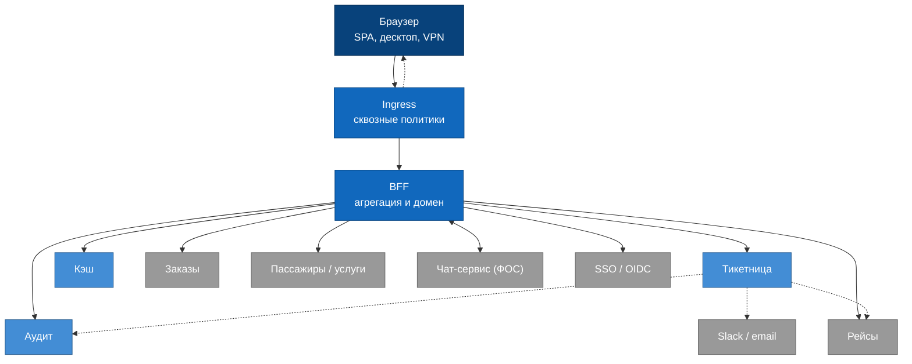
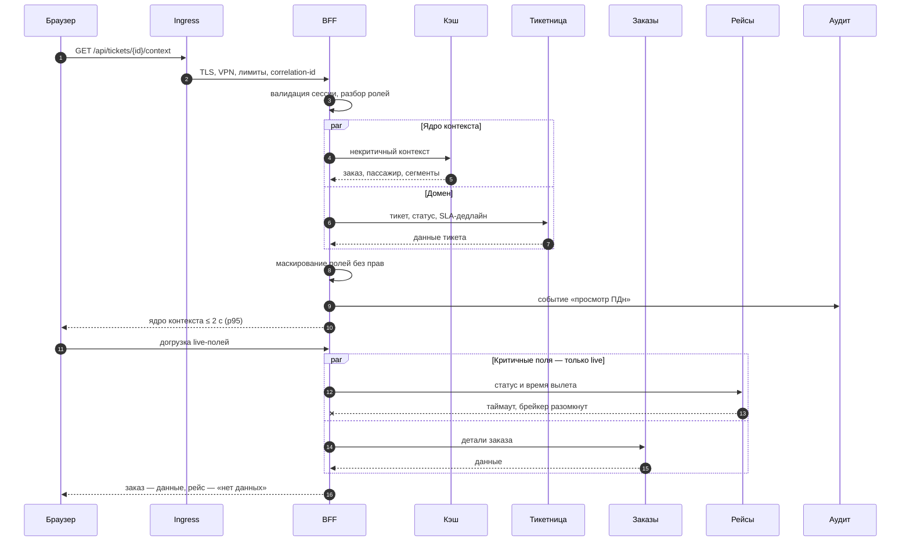

# Слой входа: схема

Две диаграммы. Первая отвечает на вопрос задания «клиент → шлюз / BFF → сервисы». Вторая показывает то, что на статической схеме не видно: ответ формируется в два приёма, и отказ одного источника не отменяет остальные.

Решения, которые здесь нарисованы, разобраны в [entry-layer.md](../entry-layer.md) и записаны в [ADR-0009](../adr/0009-entry-layer-ingress-and-bff.md). Состав клиентов — [clients-and-scenarios.md](../clients-and-scenarios.md).

## Клиент → слой входа → сервисы

Отдельного API Gateway на схеме нет — его функции выполняет ingress. Клиент один, upstream один, маршрутизировать между ними нечего; отдельное приложение добавило бы сетевой хоп и точку отказа без компенсирующего выигрыша.

Граница между двумя синими узлами проходит по знанию домена. На ingress — то, что одинаково для любого запроса: TLS, допуск из корпоративного VPN, раздача статики, роутинг `/` и `/api/*`, лимиты, старт correlation-id. В BFF — то, для чего нужно знать пользователя и предметную область: валидация сессии, роли и полевое маскирование ПДн, агрегация контекста в единую модель, таймауты и деградация. Подробная таблица — в [entry-layer.md](../entry-layer.md#граница-ответственности).

Стрелка от браузера одна, потому что SPA и API размещены на одном origin: статика и `/api/*` приезжают с одного хоста, и CORS не требуется.

Пунктир — пути, не проходящие через слой входа: раздача статики завершается на ingress; события аудита от тикетницы, SLA-алерты в Slack и фоновый запрос тикетницы к сервису рейсов для пересчёта дедлайнов идут в обход. Это важно зафиксировать, потому что у аудита два писателя, и только один из них — BFF. Извне внутрь ведёт единственный маршрут: браузер → ingress → BFF.

Четыре внешних источника нарисованы отдельными стрелками намеренно: к каждому идёт свой пул соединений со своим таймаутом и circuit breaker. Это условие, при котором один BFF остаётся работоспособным — медленный источник исчерпывает собственный пул, не затрагивая остальные пути.

## Зум: как собирается карточка тикета

На схеме выше карточка выглядит как один запрос к BFF. В действительности ответ отдаётся в два приёма, а часть источников может не ответить вовсе — и ни то, ни другое на статической картинке не видно. Развёртка по времени показывает, как одновременно удерживаются бюджет ≤ 2 с ([S3](../utility-tree.md)), изоляция отказов ([S6](../utility-tree.md)) и маскирование ПДн ([S8](../utility-tree.md)).

Ядро контекста отдаётся до догрузки live-полей: мера [S3](../utility-tree.md) останавливается на ядре, а не на последнем подгруженном блоке ([TO-1](../tradeoffs.md)). Маскирование выполняется до формирования ответа — значения без прав не покидают BFF, а не скрываются в интерфейсе ([ADR-0004](../adr/0004-permissions-in-shared.md)). Запись в аудит не блокирует ответ: доставка best-effort, критична неизменяемость записанного ([S10](../utility-tree.md)).

Отказ сервиса рейсов показан крестиком. Брейкер размыкается по таймауту, блок получает терминальное состояние «нет данных» за предсказуемое время, детали заказа приходят независимо. Карточка остаётся работоспособной, что и требует [S6](../utility-tree.md).
