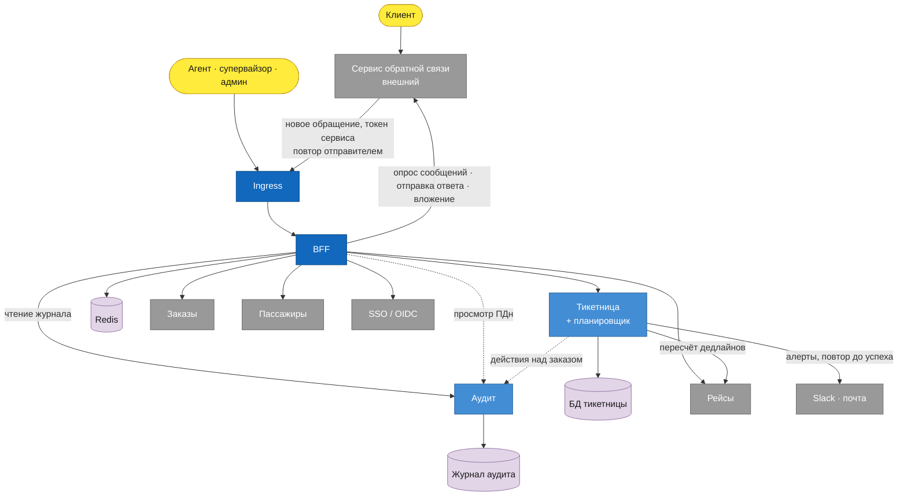
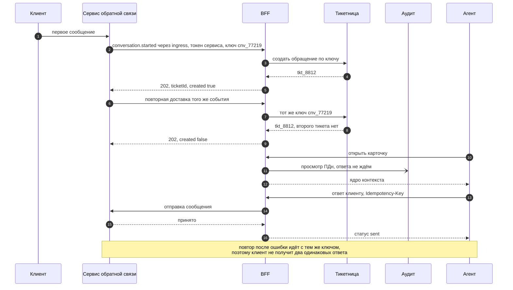

# Взаимодействия: схема

Две диаграммы. Первая показывает все стыки системы с разметкой по модели взаимодействия. Вторая разворачивает по времени путь обращения — от первого сообщения клиента до ответа агента, — потому что на статической схеме не видно ни повторов, ни ключей, которыми они отсекаются.

Разметка разобрана в [interaction-model.md](../interaction-model.md), контейнеры — в [C4 Container](../c4-container.md), слой входа — в [views/entry-layer.md](entry-layer.md).

## Карта стыков

Сплошная стрелка — вызов с ожиданием ответа. Пунктир — вызов, результат которого не ждут: по [S10](../utility-tree.md) доставка событий аудита объявлена best-effort, и редкая потеря допустима. Пунктирных стрелок в системе ровно две, и обе ведут в аудит.

Брокера на схеме нет, и это решение, а не пропуск: ни у одного события системы нет второго потребителя, а единственный кандидат на очередь — аудит — гарантии доставки не требует. Разбор — в [interaction-model.md](../interaction-model.md#почему-в-системе-нет-брокера).

Стрелка от сервиса обратной связи внутрь — единственный случай, когда инициатива идёт снаружи, и идёт она через тот же ingress, что и пользовательский трафик: по отдельному правилу допуска и с токеном сервиса ([ADR-0012](../adr/0012-inbound-call-for-new-conversations.md)). Без неё первое сообщение клиента не увидел бы никто: опрос сообщений работает только при открытой карточке, а у нового обращения карточки ещё нет.

## Путь обращения во времени

Обмены 6–9 — то, ради чего в системе заведены ключи. Отправитель повторяет вызов по своей логике и своему бюджету, поэтому приёмник обязан отличать повтор от нового обращения. Ключом служит идентификатор диалога, и он приходит снаружи: придумывать свой не требуется.

Обмен 11 показан стрелкой без ответа — единственный вид взаимодействия в системе, где инициатор не ждёт результата.

Последний обмен объясняет, почему интерфейс может показывать сообщение сразу, до подтверждения. Оптимистичный показ покупается устойчивым ключом: без него повторное нажатие после ошибки означает второй ответ клиенту.
